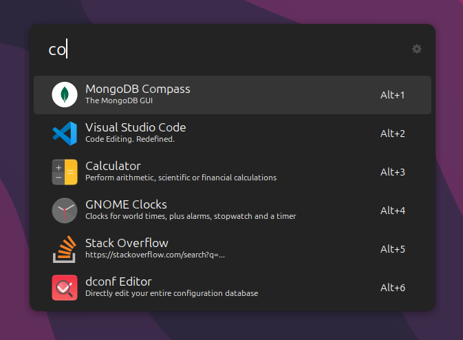

<h1 align="center">
  <code>ulauncher-theme-libadwaita-dark</code>
</h1>

<p align="center">
    <strong>A Ulauncher dark theme that looks native under <code>libadwaita</code>.</strong>
</p>

<p align="center">
    <a href="#-screenshots"><b>Screenshots</b></a>
    <span>  •  </span>
    <a href="#-installation"><b>Installation</b></a>
    <span>  •  </span>
    <a href="#-Credit"><b>Credit</b></a>  
</p>

---

A dark theme for [Ulauncher](https://ulauncher.io/) that's supposed to look native
under `libadwaita` and GTK4.

The colors and metrics were obtained by using the
[GtkInspector](https://wiki.gnome.org/Projects/GTK/Inspector) tool on the GNOME
Settings application on GNOME 43.

<br>

## ❯ Screenshots



<br>

## ❯ Installation

Run the following script in your terminal:

```bash
mkdir -p ~/.config/ulauncher/user-themes

git clone https://github.com/kareemkasem/ulauncher-theme-libadwaita-dark \
  ~/.config/ulauncher/user-themes/libadwaita-dark
```

<br>

## ❯ Credit
This theme is a fork of [leodr's amazing theme](https://github.com/leodr/ulauncher-theme-libadwaita) but modified for dark mode.
